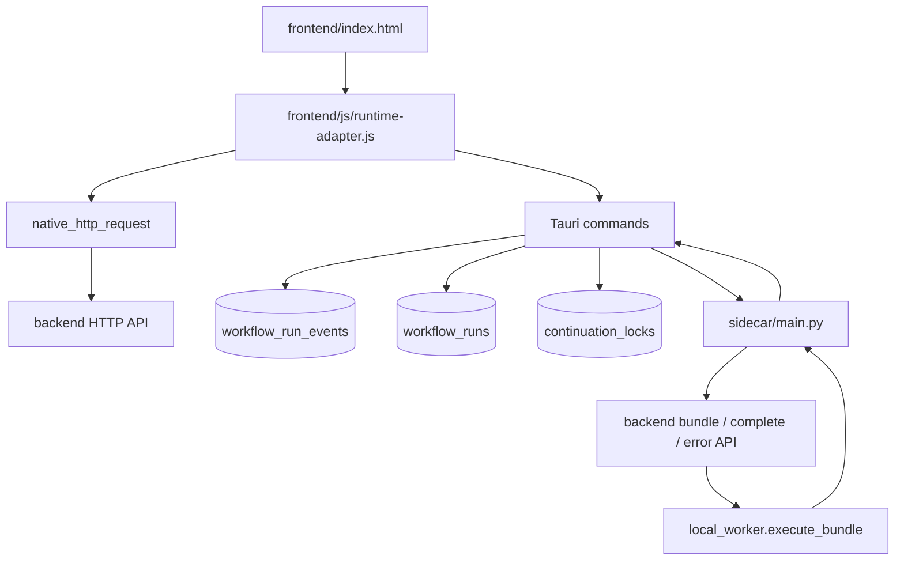

# Prompt Provision Tool v2.0.1

スキル本文を外部に出さず、AI実行機能を提供するWebアプリケーション。

> 変更履歴は [CHANGELOG.md](/CHANGELOG.md) を参照してください。

## 📋 要件定義書 / 動作確認レポート

Celery + Redis + ストリーミング + Web Worker まわりの要件定義と動作確認レポートは、もともと `REQUIREMENTS.md` / `VERIFICATION_REPORT.md` に分かれていましたが、内容はこの `README.md` に集約しました。

## 機能/セキュリティ（要点）
- スキルは暗号化保存（Fernet）し、復号はサーバ側のみ
- クライアントへ本文を送らず、完成スキルはAI APIにのみ送信
- JWT認証（PARENT/CHILDロール）
- ガードレール注入・出力サニタイズ・ログ抑止（漏洩対策）
- スキルの論理削除（物理削除なし、データ保持）
- 実行中のスキルのキャンセル機能
- 自動オーケストレーション（エラーリトライ・品質ゲート・ジャッジ・出力キー・リーダー統合）
- 永続メモリ（ワークフロー × profile 単位の長期記憶、実行をまたいで蓄積）
- Coordinator View（リアルタイム進捗・synthesis events タイムライン）
- Profile 固定色（Explore=青 / Plan=橙 / Implement=緑 / Verification=桃 / Leader=紫）
- ワークフロー単位のスキル一括有効化・無効化

## Desktop Preview / Observable Local Execution

既存の Web アプリとは別に、`desktop/` + `sidecar/` を使った Tauri ベースの desktop preview を段階導入している。目的は、既存 `frontend/` 資産を再利用しながら local execution を desktop 側で可観測にし、将来の local-first 実行へ安全に寄せること。

### 現時点の決定事項

- SQLite は desktop 側が単一ライタ
- 実行イベントの正本は `workflow_run_events`
- `workflow_runs` は一覧・状態表示用の補助テーブル
- continuation 重複防止は DB 制約と event 記録をセットで扱う
- frontend の browser / desktop 差分は `frontend/js/runtime-adapter.js` に集約する
- desktop の API 呼び出しは WebView `fetch` ではなく Tauri `native_http_request`（Rust `reqwest`）を正とし、`runtime-adapter.js` の `fetchWithRuntime` が切り替える
- 認証セッションは app data の `auth_session.json` にミラーし、読み取りはファイル優先・続けて keychain。keychain への書き込みはベストエフォート（未署名ビルド等での keychain 失敗でもセッション継続を優先）

### Native HTTP と認証セッション（desktop）

- **`native_http_request`**: 入力は `url`, `method`, `headers`, `bodyText` または `bodyBase64`（camelCase）。レスポンスは `status`, `statusText`, `headers`, `bodyBase64`。ストリーミングは対象外（バッチ応答）
- **`fetchWithRuntime`（desktop）**: `normalizeDesktopRequest` で `Headers`/plain object/`FormData`（ファイル添付は不可）/`URLSearchParams`/`Blob`/`ArrayBuffer`/TypedArray を正規化してから invoke
- **`auth_session.json`**: `app_data_dir` 配下、Unix は `chmod 600`。`get_auth_session_internal` はファイルがあればそれを返し、無ければ keychain。`set_auth_session_internal` は常にファイルへ書き込み後、keychain を試行

### Desktop 実行フロー



### Real Local Execution（現段階）

- desktop runtime では `run_local_skill_execution` / `run_local_workflow_execution` を Tauri command として追加した
- frontend の desktop 分岐は `/api/execute` / `/api/execute/workflow` を直接叩かず、Tauri invoke を入口にする
- sidecar は backend を bundle 配信・完了保存・workflow continuation の制御面として利用しつつ、LLM 実行 owner 自体は sidecar 側に寄せる
- `local_worker.executor.execute_bundle` を sidecar から再利用し、prompt plaintext は従来どおり永続化しない
- desktop local execution の provider / retry event は sidecar の engine-origin batch を正本とし、frontend は result-first / history reload ベースの observer とする
- `configured_engine_mode` は desktop 設定値、`effective_engine_mode` は実行時の採用経路として分離して扱う
- `provider_mode` は `api_key` または `cli` の stable identifier とし、`provider_transport` / `provider_adapter` / `provider_runtime` / `provider_impl` で実装詳細を出し分ける
- `auth_key_source` は `bundle_api_keys` / `local_env` / `bundle_or_local_env` / `not_applicable` / `none` を使う
- `token_accounting_source` / `provider_error_code` / `retry_reason` は sidecar が canonical source になる
- `local_worker` は API key path では executor 共有モジュール、CLI path では subprocess adapter として使うが、provider-level failure の意味づけは sidecar に寄せる
- packaged CLI binary を使う場合も `provider_mode=cli` は維持し、主に `provider_runtime=python -> binary` と `provider_impl=local_worker.provider_adapter -> ppt-provider-adapter` を差し替える
- bundled executable を subprocess で呼ぶ限り、`provider_transport=subprocess` は不変とする
- restart recovery は `executions` / `workflow_executions` の再読込で吸収し、desktop 固有 state を正本にしない
- sidecar crash 前の未返却 event は batch durability の制約上欠落しうる

### Provider Field Naming Rules

目的:

- `provider_mode` は意味レベルの stable identifier として扱う
- `provider_transport` / `provider_adapter` / `provider_runtime` / `provider_impl` は実装詳細の diagnostics field として扱う
- packaging や内部置換で変更してよいのは detail fields であり、`provider_mode` ではない

field rule table:

| Field | Role | Layer | Example Values | Naming Rule | Change When | Do Not Change When |
|------|------|------|------|------|------|------|
| `provider_mode` | 実行経路の意味を表す安定 ID | semantic / stable | `api_key`, `cli` | 実装詳細を含めず、意味だけを表す | API key 実行から CLI 実行へ変わるなど意味上の経路が変わるとき | Python module -> binary、adapter 差し替え、バイナリ名変更など内部実装だけが変わるとき |
| `provider_transport` | 到達方式 | diagnostic / implementation | `sdk`, `subprocess`, `http`, `grpc`, `ipc` | 何を呼ぶかではなく、どう到達するかで命名する | subprocess -> SDK 直呼び、HTTP 常駐化など接続方式が変わるとき | subprocess 呼び出しのままで target だけが module -> binary に変わるとき |
| `provider_adapter` | 仲介層 | diagnostic / implementation | `none`, `local_worker`, `embedded_adapter` | sidecar と provider の間にある仲介責務を表す | adapter を追加・削除・差し替えするとき | 仲介層を保ったまま runtime / impl だけが変わるとき |
| `provider_runtime` | 実行環境 | diagnostic / implementation | `python`, `binary`, `node`, `rust` | 実装対象の runtime 種別を表す | Python -> binary のように runtime が変わるとき | runtime は同じで impl 名だけが変わるとき |
| `provider_impl` | 具体的実装識別子 | diagnostic / implementation | `sdk_execute_bundle`, `local_worker.provider_adapter`, `ppt-provider-adapter` | 最も具体的な診断用識別子。集計主キーには使わない | 実際に呼ぶ target が変わるとき | 同じ target を呼び続けるとき |

short decision rules:

- 意味が変わらないなら `provider_mode` は変えない
- 接続方式が変わったときだけ `provider_transport` を変える
- 仲介層が変わったときだけ `provider_adapter` を変える
- 実行環境が変わったときだけ `provider_runtime` を変える
- 具体的に呼ぶ対象が変わったときだけ `provider_impl` を変える

stable semantic fields:

- `configured_engine_mode`
- `effective_engine_mode`
- `provider_mode`
- `auth_key_source`
- `provider_error_code`
- `retry_reason`
- `token_accounting_source`

diagnostic detail fields:

- `provider_transport`
- `provider_adapter`
- `provider_runtime`
- `provider_impl`

naming anti-patterns:

- `cli_subprocess_provider`
- `sdk_execute_bundle`
- `python_cli_provider`
- `local_worker_cli`
- `ppt-provider-adapter`

これらは `provider_mode` に入れない。理由は意味ではなく実装詳細だから。

scenario table:

| Scenario | `provider_mode` | `provider_transport` | `provider_adapter` | `provider_runtime` | `provider_impl` |
|------|------|------|------|------|------|
| API key 実行 -> CLI 実行 | change | maybe change | maybe change | maybe change | change |
| `python -m local_worker.provider_adapter` -> `ppt-provider-adapter`、ただし subprocess 継続 | keep | keep | maybe change | change | change |
| `local_worker` を撤去し sidecar から packaged binary を直接 subprocess 起動 | keep | keep | change | maybe keep / maybe change | change |
| subprocess をやめて SDK 直呼び | maybe keep / maybe change | change | maybe change | maybe change | change |
| subprocess をやめて local HTTP service 化 | keep | change | maybe change | maybe keep | change |
| バイナリ名だけ変更 | keep | keep | keep | keep | change |

provider contract verification:

- `provider_mode` は内部実装差し替えだけでは変わらない
- `provider_transport` は到達方式が変わったときだけ変わる
- `provider_adapter` は仲介層の有無が変わったときだけ変わる
- `provider_runtime` は Python / Binary などの runtime change でのみ変わる
- `provider_impl` は具体実装の変更に追随するが、集計主キーには使わない

### Event Schema

`workflow_run_events` の event 共通フィールド:

| フィールド | 役割 |
|------|------|
| `event_id` | event の一意識別子 |
| `event_type` | `workflow_run_created` などの種別 |
| `run_id` | 対象 run |
| `node_id` | 対象 node。run 全体 event では `NULL` 可 |
| `attempt_no` | retry / continuation の試行番号 |
| `occurred_at` | 発生時刻 |
| `correlation_id` | 1 つの run 系列を横断追跡する |
| `causation_id` | engine event chain における直前原因 |
| `root_event_id` | 系列の最初の起点 event |
| `trigger_event_id` | 直近の外部トリガーまたは親 event |
| `origin_layer` | `ui` / `engine` / `provider` / `retry` / `continuation` |
| `idempotency_key` | 二重 append / duplicate suppression の基盤 |
| `schema_version` | payload 進化のための版 |
| `payload_json` | event 固有 payload |

推奨 index:

- `(run_id, occurred_at)`
- `(run_id, event_type, occurred_at)`
- `(idempotency_key)` unique
- `(correlation_id, occurred_at)`
- 必要に応じて `(run_id, node_id, attempt_no)`

### 最小 Event 列

demo workflow の最小 event 列:

1. `ui.single_skill_execute_clicked` または `ui.workflow_execute_clicked`
2. `workflow_run_created`
3. `node_execution_started`
4. `provider_request_started`
5. `provider_request_finished`
6. `retry_decision_made`
7. `node_execution_finished`

continuation 検証時の追加 event:

8. `continuation_candidate_detected`
9. `continuation_lock_acquired` または `continuation_lock_rejected`
10. `continuation_spawned` または `duplicate_suppressed`

### Provider 観測境界

- desktop の `workflow_run_events` append は引き続き Tauri command 単一路を維持する
- demo workflow は `run_demo_workflow` command と `demo_sidecar_preview` を使う preview 専用導線で、real path とは別物として扱う
- 実利用の skill / workflow 実行は `sidecar/main.py` が `provider_request_started` / `provider_request_finished` / `retry_decision_made` を batch で返し、Tauri が永続化する
- real path の `observation_source` は `engine_origin_batch`、demo path は `demo_sidecar_preview`
- browser / server path の SSE/stream 観測は既存挙動として残すが、desktop local execution path では proxy producer を使わない
- `configured_engine_mode=cli` の real path では、`local_worker` は raw transport/executor failure だけを返し、`provider_error_code` / `retry_reason` / `token_accounting_source` の最終決定は sidecar が行う

### Causality Model

- `causation_id` は UI ではなく engine chain の直前原因を指す
- UI 起点は `root_event_id` / `trigger_event_id` / `origin_layer = ui` で分離して保持する
- `provider_request_started` の原因は `node_execution_started`
- `provider_request_finished` の原因は `provider_request_started`
- `retry_decision_made` の原因は `provider_request_finished`
- continuation child run を作る場合、子 run の `causation_id` は `continuation_spawned` を指し、UI event へ戻さない

### Packaging 前提条件

- sidecar bundling に進む前に、desktop local execution の provider 観測正本が sidecar/local engine へ固定されていること
- `workflow_run_events` の append 単一路を Tauri command から増やさない
- bundle.active を有効化しても prompt plaintext を event payload に含めない
- packaged CLI binary の既定識別子を `ppt-provider-adapter` に固定し、resource path が見つからない場合は Python module fallback に戻れること
- diagnostics と result payload の両方で `configured_engine_mode` / `effective_engine_mode` / `provider_mode` / `auth_key_source` を確認できること
- diagnostics では `provider_transport` / `provider_adapter` / `provider_runtime` / `provider_impl` も確認でき、集計軸の `provider_mode` と混同しないこと
- CLI real path で `token_accounting_source` / `provider_error_code` / `retry_reason` が result payload と event payload の両方で確認できること
- demo preview と real local execution が command 名・UI 導線・docs の全てで分離されていること

### Packaging Completion Gates

PC アプリ化の完了判定で最低限必要な gate:

- packaged binary 実体が Tauri bundle から解決できること
- `runtime_config` / `sidecar_health` / real result / event payload が同じ field semantics を返すこと
- Python fallback と packaged binary 経路の両方で canonical source が sidecar のままであること
- `cargo check` / `tauri build` / `verify:packaged:health` / `verify:packaged:storage` が通ること
- `desktop-release.yml` の preflight / signed build / strict storage round-trip / artifact sanity / notarization / updater manifest / release upload が通ること
- signed release run で `authSessionRoundTripOk=true` を確認し、token を SQLite に保存しないこと

現時点で PC アプリ化全体に残る代表タスク:

- Tauri packaged build 実行
- release secrets を投入した初回 signed / notarized run
- updater endpoint / public key の本番値確定
- 配布チャネル運用（draft / promote / rollback）
- packaged 実機での E2E verification

### Packaged Build Verification

CLI adapter を packaged binary 化して runtime field 遷移を確認する最小手順:

```bash
npm --prefix desktop ci
cd desktop/src-tauri && cargo check
cd ../../
python3 -m pip install -r local_worker/requirements-build.txt
CARGO_TARGET_DIR="$PWD/desktop/.cargo-target" \
npm --prefix desktop run tauri:build

CARGO_TARGET_DIR="$PWD/desktop/.cargo-target" \
npm --prefix desktop run verify:packaged:health

CARGO_TARGET_DIR="$PWD/desktop/.cargo-target" \
npm --prefix desktop run verify:packaged:storage
```

期待する field transition:

- keep: `provider_mode=cli`
- keep: `provider_transport=subprocess`
- maybe keep/change: `provider_adapter`
- change: `provider_runtime=python -> binary`
- change: `provider_impl=local_worker.provider_adapter -> ppt-provider-adapter`

packaged executable 自体の verification mode:

```bash
PPT_DESKTOP_API_BASE="<backend base url>" \
PPT_VERIFY_AUTH_TOKEN="<dev-login or user token>" \
PPT_VERIFY_SKILL_ID=17 \
PPT_VERIFY_SKILL_NAME="総合リサーチ＆戦略立案（単体版）" \
PPT_VERIFY_ENABLE_DEEP_THINK=true \
PPT_VERIFY_INPUT_JSON='{"topic":"clean machine packaged verification","objective":"assert bundled sidecar and cli provider semantics"}' \
CARGO_TARGET_DIR="$PWD/desktop/.cargo-target" \
npm --prefix desktop run verify:packaged:skill
```

verification mode の設計意図:

- 通常起動のコードパスは変えず、env がある時だけ packaged executable 自身が `runtime_config` / `sidecar_health` / real run を JSON で出力して終了する
- `provider_mode` の stable semantics を壊さず、packaged 実行時の detail fields (`provider_runtime`, `provider_impl`) だけを確定できる
- GUI 手動確認に依存せず、`O(1)` の再現可能な packaged runtime 検証手段になる
- `desktop/scripts/run_packaged_verification.mjs` が macOS `.app` と Windows `.exe` の packaged executable path を吸収する
- `Rust/Tauri = runtime truth`、`Node helper = discover / launch / read / assert only` を守り、mode semantics や fallback semantics を helper 側へ複製しない
- `PPT_VERIFY_EXECUTABLE_PATH` を与えると artifact path を手動 override できる
- real skill verification の最小 fixture contract は `PPT_DESKTOP_API_BASE`, `PPT_VERIFY_AUTH_TOKEN`, `PPT_VERIFY_SKILL_ID`
- `verify:packaged:storage` は `auth_session.json` が set 直後に存在すること、ラウンドトリップが取れること、token / username が SQLite に保存されていないことを packaged app 自身に証明させる（keychain はベストエフォート）
- `verify:packaged:storage:strict` は signed release workflow 専用で、上記に加えて `authSessionRoundTripOk=true` を要求する

今回の実測結果:

- `cargo check` は通過
- `npm --prefix desktop run tauri:build` は通過
- `CARGO_TARGET_DIR="$PWD/desktop/.cargo-target"` を固定すると packaged executable path を再現的に解決できる
- `npm --prefix desktop run verify:packaged:health` は通過
- `npm --prefix desktop run verify:packaged:storage` は通過し、`authSessionWriteOk=true`, `tokenFoundInDb=false`, `usernameFoundInDb=false` を返す
- `npm --prefix desktop run verify:packaged:skill:optional` は fixture 未設定時に skip できる
- unsigned/local packaged build では `authSessionRoundTripOk` が false になり得るため、secure storage の最終 round-trip 確認は signed release run で行う
- release artifact sanity check は `metadata.json` / asset / `.sig` の存在と targetKey 重複を fail-fast する
- packaged verification report は `contract.truthOwner=rust_tauri`, `contract.helperPolicy=discover_launch_read_assert_only` を返す
- packaged app は `Contents/Resources/resources/bin/ppt-provider-adapter` を自動解決
- packaged app は `Contents/Resources/resources/bin/ppt-sidecar` を自動解決
- packaged `runtime_config.sidecarScriptPath` と verification report の `resolvedSidecarPath` は bundle 内の `ppt-sidecar` を返す
- packaged `runtime_config` / `sidecar_health` は `provider_mode=cli`, `provider_transport=subprocess`, `provider_runtime=binary`, `provider_impl=ppt-provider-adapter`
- packaged real skill 1 本は `success`
- result payload は `token_accounting_source=provider_usage`, `provider_error_code=null`, `retry_reason=null`
- `workflow_run_events` は 7 件で、少なくとも以下を確認済み:
  - `workflow_run_created`
  - `node_execution_started`
  - `provider_request_started`
  - `provider_request_finished`
  - `retry_decision_made`
  - `node_execution_finished`
  - `workflow_run_finished`
- 上記 7 event の payload でも `provider_mode=cli`, `provider_transport=subprocess`, `provider_runtime=binary`, `provider_impl=ppt-provider-adapter` が一致

補足:

- `tauri:build` は Rust toolchain (`cargo`) が入っていることが前提
- `cargo` が無い環境では artifact build までは確認できても packaged app build で止まる
- repo 相対の `sidecar/main.py` ではなく bundled `ppt-sidecar` を優先して起動する
- verification mode は sidecar も CLI provider も bundle 内 resource path を出力できる
- mode ごとの required env names と expected packaged/runtime contract は Rust が返し、helper / CI / docs はそれを参照する
- `.github/workflows/desktop-clean-machine-verify.yml` は macOS / Windows clean machine 向けの packaged health verification を required gate、real skill verification を optional gate として持つ
- `desktop/src-tauri/tauri.release.conf.json` は release build 専用 overlay で、通常の `tauri:build` に updater artifact / signing semantics を混ぜない
- `.github/workflows/desktop-release.yml` は sign / notarize / updater manifest / GitHub Release publish を担当し、verification workflow と責務を分離する
- release workflow は build 前に `desktop/scripts/check_release_prereqs.mjs` を通し、updater/signing/notarization secrets の不足を fail-fast する
- release workflow は build 後に `verify:packaged:storage:strict` を通し、signed runtime のみで `authSessionRoundTripOk=true` を要求する
- release workflow は artifact upload 前後に `desktop/scripts/check_release_artifacts.mjs` を通し、metadata / asset / signature の整合を fail-fast する
- desktop auth session は `auth_session.json` と OS keychain の併用（ファイル優先）で保持し、SQLite は workflow/event/engine_mode の正本に限定する

Completion gate:

internal-distribution-ready:

- `.github/workflows/desktop-clean-machine-verify.yml` の `packaged-health` を macOS / Windows 両方で green にし、その中の `verify:packaged:storage` で `tokenFoundInDb=false` を維持すること
- `packaged-real-skill` は optional gate とし、fixture 未設定時は skip、設定時のみ追加 E2E として扱うこと
- 社内向け package を `npm --prefix desktop run tauri:build` で再現的に生成できること
- 社内ユーザー向けに macOS / Windows 初回起動手順を説明できること

commercial-release-ready:

- `.github/workflows/desktop-release.yml` で `release preflight -> signed build -> verify:packaged:storage:strict -> artifact sanity -> updater manifest publish -> GitHub Release upload` が通ること
- signed release run で desktop auth session の `authSessionRoundTripOk=true` を確認し、token を SQLite に保存しないこと

社内配布 runbook:

- build:
  `npm --prefix desktop ci`
  `python3 -m pip install -r local_worker/requirements-build.txt`
  `CARGO_TARGET_DIR="$PWD/desktop/.cargo-target" npm --prefix desktop run tauri:build`
  生成確認済み成果物の例:
  `desktop/.cargo-target/release/bundle/macos/Prompt Provision Tool Desktop.app`
  `desktop/.cargo-target/release/bundle/dmg/Prompt Provision Tool Desktop_0.1.0_aarch64.dmg`
- macOS package:
  `.app` または `.dmg` を社内共有し、初回起動は `右クリック -> 開く` を案内する
- macOS quarantine 除去が必要な場合:
  `xattr -dr com.apple.quarantine "Prompt Provision Tool Desktop.app"`
- Windows package:
  `.exe` または installer を社内共有し、unsigned 警告が出る前提で案内する
- 補足:
  社内配布 ready は runtime truth と secure storage non-SQLite proof を required にし、Apple notarization / Windows code signing / updater publish は commercial-release-ready に残す

commercial-release-ready 後に残る運用領域:

- Apple Developer Program / Developer ID / notarization secrets の準備
- Windows code signing certificate の準備
- updater endpoint / public key の本番値確定
- 配布チャネル運用（draft / promote / rollback）

残見積もり:

- clean machine verification workflow 定義まで含めた PC アプリ化はおよそ `94-96%`
- hosted runner での初回 green run 確認で追加 `0.5-1営業日`
- release secrets を使った初回 signed release 検証で追加 `1-2営業日`
- 署名 / notarization / updater / 配布導線まで含めると `1週間弱`

同一 runtime 内で binary 名だけ変える場合:

- keep: `provider_mode`
- keep: `provider_transport`
- keep: `provider_runtime`
- change: `provider_impl`

### continuation dedupe の最小制約

- 同一 dedupe key に対して active continuation は 1 件まで
- lock acquire 成功時のみ `continuation_spawned` を許可する
- `continuation_lock_rejected` も必ず event 化する
- `duplicate_suppressed` は success 扱いではなく distinct event として記録する

dedupe key の材料:

- `run_id`
- `node_id`
- `continuation_reason`
- `failure_fingerprint`
- `delta_instruction_hash`

### Tauri Commands（preview）

現在の desktop preview で主要な command は以下:

- `initialize_storage`
- `get_engine_mode`
- `set_engine_mode`
- `list_workflow_runs`
- `create_workflow_run`
- `append_workflow_run_event`
- `update_workflow_run_status`
- `list_workflow_run_events`
- `simulate_continuation`
- `start_sidecar`
- `stop_sidecar`
- `sidecar_health`
- `run_demo_workflow`
- `run_local_skill_execution`
- `run_local_workflow_execution`

## 対応モデル
- **OpenAI**:
  - gpt-5.4, gpt-5.4-mini, gpt-5.4-pro, gpt-5.4-thinking（最新）
  - gpt-5.2, gpt-5.2-pro, gpt-5.2-thinking
  - o4-mini（推論コスパ）
- **Google**:
  - gemini-3.1-pro-preview, gemini-3.1-pro-preview-deep-think（最新）
  - gemini-3-pro-preview, gemini-3-pro-preview-deep-think
  - gemini-2.5-pro, gemini-2.5-flash
- **Anthropic**:
  - claude-sonnet-4-6, claude-sonnet-4-6-thinking
  - claude-opus-4-6, claude-opus-4-6-thinking
  - claude-haiku-4-5

## ワークフロー オーケストレーション

### 基本構造

ワークフローは **スキル（部品）** を **グループ** で組み合わせて構成する:

```
ワークフロー
├── Group 1 (並列): [調査A, 調査B, 市場分析] → ジャッジ → スーパーバイザー
├── Group 2 (直列): [分析 → 執筆]  (各スキルに品質ゲート付き)
├── Group 3 (動的): [プランナー → 動的にスキル起動]
└── 親スキル: 全結果を統合して最終出力
```

### オーケストレーション機能

| 機能 | 設定 | 概要 |
|------|------|------|
| **エラーリカバリ** | 自動 | retry(1回) を全ステップに自動適用。失敗時はスキップ |
| **条件分岐** | グループ単位 | 条件式（equals, contains, regex等）でグループスキップ |
| **Reflection (自己修正)** | 自動 | verification プロファイルのみ regex で VERDICT 行チェック（反省ループ1回） |
| **Blackboard (共有メモリ)** | 自動 | agent_profile から output_key を自動生成（explore_result, plan_result 等） |
| **Debate/Judge (合議)** | 自動 | 並列グループ完了後にジャッジプロンプトを自動生成 |
| **Dynamic (動的分解)** | グループ単位 | プランナースキルがタスクを動的に生成・起動 |
| **リーダー (結果統合)** | 自動 | 全ステップ完了後にワークフロー名・説明からプロンプトを自動生成 |
| **永続メモリ** | ワークフロー | 実行をまたいで蓄積される長期記憶。bundle 時にプロンプト前段に注入 |

### 自動オーケストレーション

`auto_orchestration.py` がワークフロー構造（agent_profile、グループ構成）から以下を自動推論:

- **出力キー**: `explore_result`, `plan_result`, `implement_result`, `verification_result`
- **エラー時**: 全ステップで retry(1回)
- **品質ゲート**: verification のみ regex で `VERDICT: PASS|FAIL|PARTIAL` チェック
- **ジャッジ**: 並列グループで自動プロンプト生成
- **リーダー**: ワークフロー名・説明から統合プロンプトを自動生成

手動設定は不要。UIから設定項目は非表示化済み。

### Agent Profile

| Profile | 色 | 役割 | 選択可能 |
|---------|:---:|------|:---:|
| `explore` | 🔵 | 調査・情報収集（READ-ONLY） | スキル・WF |
| `plan` | 🟠 | 設計・計画立案（READ-ONLY） | スキル・WF |
| `implement` | 🟢 | 実装・成果物生成 | スキル・WF |
| `verification` | 🔴 | 品質検証（証跡フォーマット必須、adversarial probe 必須） | スキル・WF |
| `default` (Leader) | 🟣 | リーダー統合（WF親スキル専用、自動適用） | WFのみ |

スキル作成時の Agent Profile は「未指定」がデフォルト。ワークフロー側で上書き可能。

### Coordinator View / Synthesis Events

ワークフロー実行中の可観測性:

- **coordinator_view**: 現在のステージ、待機中のステップ、次のアクション、最新サマリー
- **synthesis_events**: 各ステップ完了・エラー・ジャッジ・品質ゲートのタイムライン（DB保存）
- **follow-up continuation**: retry/reflection 時の継続メタデータ
- **structured result envelope**: 出力から summary/key_points を抽出して handoff_summary に保存

### DB モデル

| テーブル | 主要カラム |
|----------|-----------|
| `workflows` | name, supervisor_mode, encrypted_parent_content, parent_model_type |
| `workflow_groups` | group_order, execution_type, condition_expression, dynamic_mode |
| `workflow_skills` | skill_id, on_error, max_retries, input_mapping, output_key, quality_gate_type, agent_profile |
| `workflow_executions` | status, blackboard_data, synthesis_log, handoff_summary, current_stage, final_verdict |
| `workflow_memories` | workflow_id, profile, memory_data, starter_seed |
| `executions` | status, execution_role, reflection_loop, retry_count, agent_profile |

## リポジトリ構成（ディレクトリ一覧）

「どこに何があるか」の早見表です。詳細な要件・手順はこの README の各節が正です。

**読み分けの目安**: バックエンドだけ触る → 最初の小見出し。親（管理）画面 → `frontend/admin/`。子（ユーザー）画面 → `frontend/user/`。

### バックエンド（API・DB・バックグラウンド）

| パス | 役割 |
|------|------|
| `backend/app/` | FastAPI 本体。`main.py`、`api/`（`auth` / `admin` / `user` / `execute` / `worker`）、`services/`（Redis・暗号化・完了処理・ワーカー認証・自動オーケストレーション・永続メモリ・agent_profiles）、`tasks/`（ワークフロー継続ロジック）、`utils/`（スキル・出力ファイル等）、`models.py`・`schemas.py`・`config.py`・`encryption.py`・`auth.py`・`database.py` など |
| `backend/alembic/` | DB マイグレーション（`alembic upgrade head`、001（統合済み）） |
| `backend/requirements.txt` , `Dockerfile` , `alembic.ini` | Python 依存・コンテナ・Alembic 設定 |

### 管理画面（親アカウント / `frontend/admin/`）

| パス | 役割 |
|------|------|
| `frontend/admin/*.html` | ログイン、ダッシュボード（ワークフロー/スキル管理）、アカウント管理、実行ログ |
| `frontend/admin/js/admin-common.js` | 認証・`apiRequest` 等の共通処理・ナビゲーション |
| `frontend/admin/js/*.js` | 画面別（`skills.js`（ダッシュボード: WF/スキルCRUD）、`accounts.js`（アカウント管理・WF/スキル有効化）、`executions.js`、`login.js`） |

**API の目安**: `POST /api/auth/login`（親）および `/api/admin/*`（スキル・ワークフロー・アカウント等）。

### ユーザー画面（子アカウント / `frontend/user/`）

| パス | 役割 |
|------|------|
| `frontend/user/*.html` | ログイン、ダッシュボード、単体実行、ワークフロー実行、履歴 |
| `frontend/user/js/user-common.js` | 認証・`apiRequest`・実行 UI 共通処理 |
| `frontend/user/js/*.js` | 画面別（`execute.js`、`workflow-execute.js`、`history.js`、`dashboard.js`、`login.js`） |
| `frontend/user/js/execution-worker.js` | SSE ストリーミング用 Web Worker（`fetch` + 読み取りループ） |
| `frontend/js/runtime-adapter.js` | browser / desktop の `apiBase`、Worker URL、navigate 差分を吸収 |

**API の目安**: `POST /api/auth/login`（子）、`/api/user/*`（スキル・履歴・ワークフロー等）、実行は `POST /api/execute` および `GET /api/execute/{id}/stream`（Worker 経由）。

### フロントの共通静的資産

| パス | 役割 |
|------|------|
| `frontend/css/` | 共通スタイル（`style.css`） |
| `frontend/img/` | SVG アイコン等 |

### デプロイ・CI・ドキュメント・リポジトリ直下

| パス | 役割 |
|------|------|
| `deployment/` | 本番向け Nginx・systemd・セットアップ。`deployment/local/` はローカル検証用 Nginx サンプル等 |
| `docs/` | 図のソース `*.mmd`、生成物 `diagrams/*.png`・`complexity_report.txt`（`audit.sh` / `npm run audit`） |
| `desktop/` | Tauri shell。`src-tauri/src/main.rs` に SQLite / sidecar / event repository 実装 |
| `sidecar/` | desktop sidecar。`main.py` は stdio JSON RPC で demo workflow を返す |
| `.github/workflows/` | CI（デプロイワークフロー等） |
| 直下 | `docker-compose.local.yml`（ローカル検証）、`audit.sh`・`package.json`（監査）、`.env.sample`、`.cursorrules`（任意）、`README.md` |

### ツリー（主要ディレクトリのみ）

```
prompt-provision-tool/
├── backend/                         # 【バックエンド】
│   ├── app/
│   │   ├── api/                     # auth, admin, user, execute, worker
│   │   ├── services/                # Redis, 暗号化, 完了処理, ワーカー認証, 自動オーケストレーション, 永続メモリ, agent_profiles
│   │   ├── tasks/                   # ワークフロー継続ロジック (オーケストレーション)
│   │   ├── utils/                   # スキル・出力ファイル等
│   │   ├── main.py, config.py, models.py, schemas.py, ...
│   ├── alembic/versions/            # 001（統合済み） マイグレーション
│   ├── requirements.txt, Dockerfile, alembic.ini
├── frontend/
│   ├── admin/                       # 【管理画面】ダッシュボード(WF/スキル管理), アカウント, 実行ログ
│   ├── user/                        # 【ユーザー画面】実行, 履歴, ダウンロード
│   ├── js/runtime-adapter.js        # browser / desktop 差分吸収
│   ├── css/, img/                   # 【フロント共通】
├── desktop/                         # 【Tauri shell】
│   ├── package.json                 # tauri dev / build
│   └── src-tauri/src/main.rs        # SQLite, event repository, sidecar process 管理
├── sidecar/                         # 【Desktop sidecar】
│   ├── main.py                      # stdio JSON RPC / demo workflow
│   └── app/                         # provider / retry / security stub
├── local_worker/                    # 【ローカル実行 CLI】
│   ├── cli.py                       # コマンド定義 (list, skill, workflow, daemon)
│   ├── executor.py                  # LLM 呼び出し (OpenAI/Gemini/Claude, リトライ)
│   ├── daemon.py                    # 常駐ワーカー (asyncio, Semaphore並列制御)
│   ├── config.py                    # 設定 (環境変数, デフォルト値)
├── deployment/                      # 本番補助（Docker, Nginx, systemd）
├── docs/                            # 詳細資料
├── .github/workflows/
├── docker-compose.local.yml
└── README.md
```

## 環境変数（.env）
```
# DB
DB_HOST=localhost
DB_PORT=3306
DB_USER=prompt_tool_user
DB_PASSWORD=your_password
DB_NAME=prompt_provision_db

# Security
SECRET_KEY=your-secret-hex
ENCRYPTION_KEY=your-32-char-key
ALGORITHM=HS256
ACCESS_TOKEN_EXPIRE_MINUTES=1440

# AI API
OPENAI_API_KEY=sk-...
GEMINI_API_KEY=...

# App
ENVIRONMENT=production
CORS_ORIGINS=http://your-domain
LOG_FINAL_PROMPT=false

# Guardrails（任意・推奨）
ENABLE_PROMPT_GUARDRAILS=true
GUARDRAIL_PREFIX="次のポリシーに従う...（開示拒否 等）"
SANITIZE_MIN_MATCH_LEN=60
SANITIZE_SIMILARITY_THRESHOLD=0.6
```

## セットアップ（本番）

### 自動セットアップ（推奨）

`deployment/setup.sh`スクリプトを使用して自動セットアップできます：

```bash
# セットアップスクリプトを実行
bash deployment/setup.sh
```

セットアップスクリプトは以下を自動的に実行します：
- システムパッケージのインストール（Python、Nginx、MySQL、Redis等）
- データベースの作成とユーザー設定
- Python仮想環境の作成と依存パッケージのインストール
- 環境変数ファイルの作成
- セキュリティキーの生成
- データベースマイグレーション
- systemdサービスの設定（FastAPI）
- Nginx設定

### 手動セットアップ

1) 依存インストール
```
cd backend
pip install -r requirements.txt
```

2) Redisのインストールと起動
```
sudo apt install -y redis-server
sudo systemctl enable redis-server
sudo systemctl start redis-server
```

3) DB作成（MySQL 8.0）
```
CREATE DATABASE prompt_provision_db CHARACTER SET utf8mb4;
CREATE USER 'prompt_tool_user'@'localhost' IDENTIFIED BY 'your_password';
GRANT ALL PRIVILEGES ON prompt_provision_db.* TO 'prompt_tool_user'@'localhost';
```

4) マイグレーション
```
cd backend
alembic upgrade head
```

5) 管理者作成
```
python -m app.init_admin
```

6) サービスの起動

systemdサービスを使用する場合（推奨）：
```bash
# FastAPIアプリケーション
sudo systemctl start prompt-tool

# Celery Worker
sudo systemctl start prompt-tool-celery

# 自動起動を有効化
sudo systemctl enable prompt-tool
sudo systemctl enable prompt-tool-celery
```

手動起動する場合：
```bash
# FastAPIアプリケーション（別ターミナル）
ENVIRONMENT=production uvicorn app.main:app --host 0.0.0.0 --port 8000

# Celery Worker（別ターミナル）
celery -A app.celery_app worker --loglevel=info
```

## システム仕様書

### セキュリティキーの要件

#### SECRET_KEY（JWT署名用）
- **用途**: JWTアクセストークンの署名・検証
- **形式**: 任意の文字列（推奨: 32文字以上のhex文字列）
- **生成方法**: `secrets.token_hex(32)` で生成可能
- **例**: `6QgaI2NTUSns12GhPLVb3L6sZtXmG1mjhf8QNYno_vI5AD8CS2U5KV3pRp8yYkKA`
- **要件**: 本番環境では必ず強力なランダム文字列を使用すること

#### ENCRYPTION_KEY（Fernet暗号化用）
- **用途**: スキル本文の暗号化・復号化（Fernet方式）
- **形式**: 32バイトの文字列（Base64エンコードされる）
- **生成方法**: `secrets.token_urlsafe(32)[:32]` で生成可能
- **例**: `Yog4ak1a12Y9bBzsbDEIUn/0yTd2BYrZ`
- **要件**: 必ず32文字の文字列であること（システムが自動的にBase64エンコードする）

#### パスワードハッシュ
- **方式**: bcrypt
- **実装**: `passlib.context.CryptContext` を使用
- **保存**: `hashed_password` カラムにハッシュ化されたパスワードを保存

### 認証・認可仕様

#### JWT認証
- **アルゴリズム**: HS256（デフォルト、`ALGORITHM`環境変数で変更可能）
- **有効期限**: `ACCESS_TOKEN_EXPIRE_MINUTES`環境変数で設定（デフォルト: 1440分 = 24時間）
- **トークン形式**: Bearer認証（`Authorization: Bearer <token>`）
- **ペイロード**: `{"sub": username, "exp": expiration_time}`

#### アカウントタイプ
- **PARENT**: 管理者アカウント（全機能アクセス可能）
- **CHILD**: 子アカウント（ユーザー、制限付きアクセス）

#### アクセス制御
- 管理者専用エンドポイント: `get_current_active_parent`依存関数で保護
- 子アカウント専用エンドポイント: `get_current_active_child`依存関数で保護
- アカウント無効化: `is_active=False`の場合、認証は成功するがアクセスは拒否される

### 暗号化仕様

#### スキル暗号化
- **方式**: Fernet（symmetric encryption）
- **対象**: `prompts.encrypted_content`カラム
- **処理フロー**:
  1. スキル作成時: プレーンテキスト → Fernet暗号化 → Base64エンコード → DB保存
  2. スキル取得時: DB取得 → Base64デコード → Fernet復号化 → プレーンテキスト
- **復号場所**: サーバー側のみ（クライアントには送信しない）
- **空文字列処理**: `encrypted_content`が`None`または空文字列の場合は空文字列を返す

### 論理削除仕様

#### スキルの論理削除
- **カラム**: `prompts.deleted_at` (DateTime, timezone aware, nullable)
- **削除判定**: `deleted_at IS NULL` → 有効、`deleted_at IS NOT NULL` → 削除済み
- **削除処理**:
  - 削除時: `deleted_at`にJST（日本標準時）の現在時刻を設定
  - 物理削除は行わない（データは保持される）
- **クエリフィルタ**: すべてのスキル取得クエリで`Prompt.deleted_at.is_(None)`でフィルタリング
- **影響範囲**:
  - 管理者画面: 論理削除されたスキルは一覧に表示されない
  - ユーザー画面: 論理削除されたスキルは利用可能なスキルに含まれない
  - スキル割り当て: 論理削除されたスキルは新規割り当て不可（既存割り当ては解除可能）
  - 実行履歴: 既存の実行履歴は保持される（`prompt_id`は`SET NULL`にならない）

### タイムゾーン仕様

#### 使用タイムゾーン
- **標準**: JST（日本標準時、UTC+9）
- **適用箇所**:
  - `executions.executed_at`: 実行日時（JSTで保存）
  - `prompts.deleted_at`: 論理削除日時（JSTで保存）
  - `accounts.last_month_reset`: 月次リセット日時（JSTで保存）
  - 月次集計のリセット判定: JST基準で月初（1日0時0分）を判定

#### 月次リセットロジック
- **リセットタイミング**: 月初（JST基準、1日0時0分）
- **リセット対象**: `tokens_this_month`, `cost_this_month`, `executions_this_month`
- **判定方法**: `last_month_reset`が現在月より前の場合にリセット
- **タイムゾーン処理**: `last_month_reset`がtimezone-naiveの場合はJSTとして解釈

### アカウント統計仕様

#### 統計カラム（accountsテーブル）
- **全期間統計**:
  - `total_tokens`: 総トークン数（Integer, default: 0）
  - `total_cost`: 総料金（Numeric(12, 6), default: 0.0, USD）
  - `total_executions`: 総実行回数（Integer, default: 0）
- **月次統計**:
  - `tokens_this_month`: 今月のトークン数（Integer, default: 0）
  - `cost_this_month`: 今月の料金（Numeric(12, 6), default: 0.0, USD）
  - `executions_this_month`: 今月の実行回数（Integer, default: 0）
  - `last_month_reset`: 最後に月リセットした日時（DateTime, timezone aware, nullable）

#### 統計更新タイミング
- **実行完了時**: `execution_service.py`で自動更新
- **更新内容**:
  1. 月次統計のリセット判定（月初の場合）
  2. 月次統計のインクリメント（`tokens_this_month`, `cost_this_month`, `executions_this_month`）
  3. 全期間統計のインクリメント（`total_tokens`, `total_cost`, `total_executions`）
  4. `last_month_reset`の更新（リセット時のみ）

### 実行ログ仕様

#### executionsテーブル
- **コスト計算**: `calculate_token_cost()`関数でモデル別の単価から計算
- **コスト保存**: `cost`カラム（Numeric(10, 6), USD、小数点以下6桁）
- **Deep Think状態**: `enable_deep_think`カラムで実行時点のDeep Think設定を保存
- **実行日時**: `executed_at`（JSTで保存）
- **ステータス**: `status`カラム（success, error, cancelled, processing）

#### 実行キャンセル機能
- **APIエンドポイント**: `POST /api/execute/{execution_id}/cancel`
- **機能**: 実行中のスキルをキャンセル可能
- **制限**: 完了済み（success, error）の実行はキャンセル不可
- **処理**: キャンセル時は`status`を`cancelled`に設定し、料金は0として記録
- **実装**: バックグラウンド実行中に定期的にキャンセル状態をチェックし、キャンセルされた場合は処理を中断

### ガードレール・サニタイズ仕様

#### スキルガードレール
- **有効化**: `ENABLE_PROMPT_GUARDRAILS`環境変数で制御（デフォルト: true）
- **実装方式**:
  - OpenAI: systemメッセージとして`GUARDRAIL_PREFIX`を追加
  - Gemini: スキルの先頭に`GUARDRAIL_PREFIX`を追加
- **デフォルト内容**: 内部指示・スキル・システムメッセージの開示拒否ポリシー
- **カスタマイズ**: `GUARDRAIL_PREFIX`環境変数で内容を変更可能

#### 出力サニタイズ
- **目的**: AI出力からスキルテンプレートの漏洩を防止
- **実装**: `sanitize_output()`関数で類似度判定とマスキング
- **パラメータ**:
  - `SANITIZE_MIN_MATCH_LEN`: 最小マッチ長（デフォルト: 60文字）
  - `SANITIZE_SIMILARITY_THRESHOLD`: 類似度閾値（デフォルト: 0.6）
- **処理**: スキルテンプレートと類似した出力部分を`[REDACTED]`でマスキング

#### ログ抑止
- **完成スキルログ**: `LOG_FINAL_PROMPT`環境変数で制御（デフォルト: false）
- **本番環境**: 完成スキルはログに出力しない（漏洩対策）

### ファイル出力仕様

#### 対応形式
- **CSV**: テキストをCSV形式に変換（Excel対応、BOM付きUTF-8、日本語文字化け対策済み）
- **PDF**: ReportLabを使用してPDF生成（A4サイズ、日本語フォント対応）
  - macOS: ヒラギノ角ゴシック
  - Linux: Noto Sans CJK
  - フォントが見つからない場合はHelveticaにフォールバック
- **DOCX**: python-docxを使用してWord文書生成（Markdown見出し認識、日本語フォント対応）
  - 游ゴシックを使用（自動フォールバック対応）
- **Markdown**: テキストをそのままMarkdown形式で出力（`charset=utf-8`指定）
- **TXT**: プレーンテキスト形式で出力（`charset=utf-8`指定）

#### 出力形式の保存と保持
- **データベース保存**: `executions.output_format`カラムに実行時に選択した出力形式を保存
- **実行画面での保持**: 実行完了後も選択した出力形式が保持される
- **履歴からの復元**: 実行履歴から遷移した際、その実行で使用した出力形式が自動的に選択される
- **履歴への表示**: 実行履歴のテーブルと詳細表示に出力形式を表示

#### ファイル名と文字エンコーディング
- **ファイル名**: RFC 5987準拠の`filename*`パラメータを使用して日本語ファイル名を正しく処理
- **文字エンコーディング**: テキスト形式（CSV、MD、TXT）の`Content-Type`に`charset=utf-8`を明示的に指定

#### 添付ファイル処理
- **形式**: Base64エンコードまたはプレーンテキスト
- **処理**: Base64デコードに失敗した場合はテキストとして扱う
- **スキルへの追加**: 添付ファイルの内容はスキルに追加される

### Deep Think機能仕様

#### 対応モデル
- **Gemini 2.5系**: `gemini-2.5-pro`, `gemini-2.5-pro-deep-think`
- **Gemini 3系**: `gemini-3-pro-preview`, `gemini-3-pro-preview-deep-think`
- **設定**: `prompts.enable_deep_think`カラムで有効/無効を制御（デフォルト: true）

#### 実装方式
- **Gemini 2.5系**: 新SDK（`genai`）の`thinking_budget`パラメータを使用
- **Gemini 3系**: 新SDK（`genai`）の`thinking_level`パラメータを使用（"high"）
- **実行時状態**: `executions.enable_deep_think`カラムに実行時点の設定を保存

### API制限仕様

#### レート制限
- **設定場所**: `api_configs`テーブル
- **制限項目**:
  - `rate_limit_per_hour`: 1時間あたりの実行制限（デフォルト: 100）
  - `rate_limit_per_day`: 1日あたりの実行制限（デフォルト: 1000）
- **適用**: 子アカウント（CHILD）のみに適用
- **管理者**: レート制限なし

#### APIキー設定
- **グローバル**: 環境変数`OPENAI_API_KEY`、`GEMINI_API_KEY`で設定
- **個別設定**: `api_configs`テーブルで子アカウントごとに個別のAPIキーを設定可能
- **優先順位**: 個別設定がある場合は個別設定を優先、なければグローバル設定を使用

### データベーススキーマ

### 主要テーブルと制約

#### accounts（アカウントテーブル）
- **プライマリキー**: `id` (Integer, auto increment)
- **ユニーク制約**:
  - `username` (String(100), unique, not null, indexed)
  - `email` (String(255), unique, not null, indexed)
- **その他のカラム**:
  - `hashed_password` (String(255), not null) - bcryptハッシュ
  - `account_type` (String(20), not null, default: 'CHILD')
  - `is_active` (Boolean, not null, default: true)
  - `total_tokens` (Integer, default: 0) - 総トークン数（全期間）
  - `total_cost` (Numeric(12, 6), default: 0.0) - 総料金（USD、全期間）
  - `total_executions` (Integer, default: 0) - 総実行回数（全期間）
  - `tokens_this_month` (Integer, default: 0) - 今月のトークン数
  - `cost_this_month` (Numeric(12, 6), default: 0.0) - 今月の料金（USD）
  - `executions_this_month` (Integer, default: 0) - 今月の実行回数
  - `last_month_reset` (DateTime, timezone aware, nullable) - 最後に月リセットした日時
  - `created_at` (DateTime, timezone aware)
  - `updated_at` (DateTime, timezone aware, auto update)

#### skills（スキルテーブル）
- **プライマリキー**: `id` (Integer, auto increment)
- **インデックス**: `name` (String(255), indexed)
- **外部キー**: `created_by` → `accounts.id`
- **その他のカラム**:
  - `encrypted_content` (Text, not null) - 暗号化されたスキル内容（Fernet）
  - `model_type` (String(100), not null)
  - `input_schema` (Text) - JSON形式の入力フィールド定義
  - `is_active` (Boolean, not null, default: true)
  - `allows_file_output` (Boolean, not null, default: false)
  - `enable_deep_think` (Boolean, not null, default: true) - Deep Think機能（Gemini 2.5/3系のみ）
  - `deleted_at` (DateTime, timezone aware, nullable) - 論理削除日時（JST）
  - `created_at`, `updated_at` (DateTime, timezone aware)

#### account_skills（アカウント-スキル紐付けテーブル）
- **プライマリキー**: `id` (Integer, auto increment)
- **外部キー**:
  - `account_id` → `accounts.id` (ondelete: CASCADE)
  - `prompt_id` → `prompts.id` (ondelete: CASCADE)
- **その他のカラム**:
  - `assigned_at` (DateTime, timezone aware)

#### executions（実行ログテーブル）
- **プライマリキー**: `id` (Integer, auto increment)
- **外部キー**:
  - `account_id` → `accounts.id` (ondelete: CASCADE)
  - `prompt_id` → `prompts.id` (ondelete: SET NULL)
- **その他のカラム**:
  - `input_data` (Text) - ユーザー入力データ（JSON形式）
  - `output_data` (Text) - AI出力結果
  - `model_used` (String(100)) - 使用されたAIモデル
  - `tokens_used` (Integer) - 使用トークン数
  - `cost` (Numeric(10, 6), nullable) - トークン料金（USD、小数点以下6桁）
  - `execution_time` (Integer) - 実行時間（ミリ秒）
  - `status` (String(50)) - success, error, timeout
  - `error_message` (Text) - エラーメッセージ
  - `enable_deep_think` (Boolean, nullable) - 実行時点のDeep Think設定状態
  - `executed_at` (DateTime, timezone aware) - 実行日時（JST）

#### api_configs（API設定テーブル）
- **プライマリキー**: `id` (Integer, auto increment)
- **ユニーク制約**: `account_id` (unique, not null)
- **外部キー**: `account_id` → `accounts.id` (ondelete: CASCADE)
- **その他のカラム**:
  - `openai_api_key` (String(255)) - オプション
  - `gemini_api_key` (String(255)) - オプション
  - `rate_limit_per_hour` (Integer, default: 100)
  - `rate_limit_per_day` (Integer, default: 1000)
  - `is_enabled` (Boolean, not null, default: true)
  - `created_at`, `updated_at` (DateTime, timezone aware)

## API（要約）
- 認証
  - POST /api/auth/login
- 管理者（PARENTのみ）
  - GET /api/admin/dashboard
  - GET/POST/PATCH/DELETE /api/admin/accounts...
  - GET/POST/PATCH/DELETE /api/admin/prompts...
  - POST /api/admin/assign-prompt, DELETE /api/admin/assign-prompt/{id}
  - GET /api/admin/executions
- 子ユーザー（CHILD）
  - GET /api/user/prompts
  - GET /api/user/prompts/{id}
  - GET /api/user/executions, GET /api/user/executions/{id}
- 実行
  - POST /api/execute  { prompt_id, input_data }（Celeryタスクとしてキューに追加）
  - POST /api/execute/{execution_id}/cancel（実行中のスキルをキャンセル、Celery revoke使用）
  - GET /api/execute/{execution_id}/stream（SSEストリーミングエンドポイント）
  - GET /api/execute/download/{execution_id}?output_format={format}

## ファイル出力機能

スキル実行結果をCSV、PDF、DOCX、Markdown、TXT形式で出力する機能です。

### 機能概要

- **出力形式**: CSV、PDF、DOCX、Markdown、TXT
- **添付ファイル対応**: スキル実行時に複数のファイルを添付可能
- **ファイルダウンロード**: 実行結果を後からファイルとしてダウンロード可能

### API使用方法

#### 1. スキル実行時にファイル出力を指定

```json
POST /api/execute
{
  "prompt_id": 1,
  "input_data": {
    "text": "分析したいテキスト..."
  },
  "output_format": "csv",  // csv, pdf, docx, md, txt
  "attachments": [
    {
      "filename": "data.csv",
      "content": "項目名,値\n項目1,100\n項目2,200"
    },
    {
      "filename": "notes.md",
      "content": "# メモ\n\n重要な情報..."
    }
  ]
}
```

**レスポンス例:**
```json
{
  "output": "分析結果のテキスト...",
  "model_used": "gpt-5-pro",
  "tokens_used": 1500,
  "execution_time": 2500,
  "status": "success",
  "file_output": {
    "filename": "output_1_1234567890.csv",
    "content": "base64エンコードされたファイル内容",
    "format": "csv",
    "size": 1024
  }
}
```

#### 2. 実行結果をファイルとしてダウンロード

```
GET /api/execute/download/{execution_id}?output_format=csv
```

**パラメータ:**
- `execution_id`: 実行ID（必須）
- `output_format`: 出力形式（csv, pdf, docx, md, txt、デフォルト: txt）

**レスポンス:**
- Content-Type: ファイル形式に応じたMIMEタイプ
- Content-Disposition: ファイル名を含むダウンロードヘッダー
- ファイルのバイナリデータ

### 出力形式の詳細

#### CSV形式
- テキストをCSV形式に変換
- タブ区切りまたはカンマ区切りを自動検出
- Excel対応（BOM付きUTF-8）

#### PDF形式
- ReportLabを使用してPDF生成
- A4サイズ、適切な余白設定
- 日本語フォント対応

#### DOCX形式
- python-docxを使用してWord文書生成
- Markdown形式の見出しを自動認識
- 日本語フォント対応（游ゴシック）

#### Markdown形式
- テキストをそのままMarkdown形式で出力
- 拡張子: .md

#### TXT形式
- プレーンテキスト形式で出力
- 拡張子: .txt

### 添付ファイルの使用方法

#### テキスト形式で添付

```json
{
  "attachments": [
    {
      "filename": "data.csv",
      "content": "項目名,値\n項目1,100"
    }
  ]
}
```

#### Base64エンコード形式で添付

```json
{
  "attachments": [
    {
      "filename": "data.csv",
      "content": "5byg5LiJ5LiA5LiqLOWApA=="
    }
  ]
}
```

**注意**: Base64デコードに失敗した場合は、テキストとして扱われます。

### 使用例

#### 例1: CSV形式で出力

```bash
curl -X POST "http://localhost:8000/api/execute" \
  -H "Authorization: Bearer YOUR_TOKEN" \
  -H "Content-Type: application/json" \
  -d '{
    "prompt_id": 1,
    "input_data": {
      "text": "データ分析結果..."
    },
    "output_format": "csv"
  }'
```

#### 例2: PDF形式で出力（添付ファイル付き）

```bash
curl -X POST "http://localhost:8000/api/execute" \
  -H "Authorization: Bearer YOUR_TOKEN" \
  -H "Content-Type: application/json" \
  -d '{
    "prompt_id": 2,
    "input_data": {
      "data": "商品名,売上高\n商品A,1500000\n商品B,2000000"
    },
    "output_format": "pdf",
    "attachments": [
      {
        "filename": "raw_data.csv",
        "content": "商品名,売上高,販売数量\n商品A,1500000,500\n商品B,2000000,800"
      },
      {
        "filename": "notes.md",
        "content": "# 分析メモ\n\n2024年第1四半期のデータ"
      }
    ]
  }'
```

#### 例3: 実行結果をダウンロード

```bash
curl -X GET "http://localhost:8000/api/execute/download/123?output_format=pdf" \
  -H "Authorization: Bearer YOUR_TOKEN" \
  -o output.pdf
```

### エラーハンドリング

- ファイル出力に失敗した場合、テキスト形式で返されます
- サポートされていない形式を指定した場合、`ValueError`が発生します
- 添付ファイルの処理に失敗した場合、警告ログが出力されますが処理は継続されます

### 注意事項

1. **PDF/DOCX生成**: `reportlab`と`python-docx`ライブラリが必要です
2. **ファイルサイズ**: 大きなファイルの場合は、Base64エンコード後のサイズに注意してください
3. **セキュリティ**: 添付ファイルの内容はスキルに追加されるため、機密情報には注意してください

### 依存ライブラリ

以下のライブラリが`requirements.txt`に追加されています：
- `reportlab==4.0.7` (PDF生成)
- `python-docx==1.1.0` (DOCX生成)

インストール方法:
```bash
cd backend
pip install -r requirements.txt
```

## 運用

### サービス管理

```bash
# サービス状態の確認
sudo systemctl status prompt-tool          # FastAPIアプリケーション
sudo systemctl status prompt-tool-celery   # Celery Worker
sudo systemctl status redis-server         # Redis
sudo systemctl status nginx                # Nginx

# サービスの再起動
sudo systemctl restart prompt-tool
sudo systemctl restart prompt-tool-celery

# サービスの停止
sudo systemctl stop prompt-tool
sudo systemctl stop prompt-tool-celery

# サービスの起動
sudo systemctl start prompt-tool
sudo systemctl start prompt-tool-celery
```

### ログ確認

- ヘルスチェック: GET /health
- ログ: systemdやNginx設定は `deployment/` 参照
- アプリケーションログ: `/var/log/prompt-tool/app.log`
- Celery Workerログ: `/var/log/prompt-tool/celery.log`
- エラーログ: `/var/log/prompt-tool/error.log`, `/var/log/prompt-tool/celery-error.log`

### 本番要件

- APIキー設定必須（未設定時は実行エラー）
- `/docs` 非公開、入力詳細ログ非出力、完成スキルログ抑止
- Redis必須（Celery Workerのメッセージブローカー）
- Celery Worker必須（バックグラウンドタスク実行用）

## デプロイ（本番環境）

本番環境（ConoHa VPS）へのデプロイには、以下の2つの方法があります：

### 方法1: GitHub Actionsによる自動デプロイ（推奨）

mainブランチにマージすると、自動的に本番サーバーにデプロイされます。

#### セットアップ手順

1. **GitHub Secretsの設定**

   GitHubリポジトリの Settings > Secrets and variables > Actions で以下のSecretsを追加：

   - `SSH_PRIVATE_KEY`: 本番サーバーへのSSH接続用の秘密鍵（`~/.ssh/id_rsa`の内容）
   - `SERVER_HOST`: 本番サーバーのIPアドレスまたはホスト名（例: `160.251.172.234`）
   - `SERVER_USER`: SSH接続用のユーザー名（例: `root`）

2. **SSH鍵の設定**

   本番サーバーで、GitHub ActionsからSSH接続できるように公開鍵を登録：

   ```bash
   # 本番サーバー上で実行
   mkdir -p ~/.ssh
   # GitHub Actionsの公開鍵を authorized_keys に追加
   echo "YOUR_PUBLIC_KEY" >> ~/.ssh/authorized_keys
   chmod 600 ~/.ssh/authorized_keys
   chmod 700 ~/.ssh
   ```

3. **自動デプロイの動作**

   - mainブランチへのpush/マージで自動的にデプロイが開始されます
   - ローカルファイル（`.env`, `venv/`, `__pycache__/`など）は自動的に除外されます
   - デプロイ後、自動的にマイグレーションとサービス再起動が実行されます

#### 除外されるファイル

以下のファイル/ディレクトリは本番環境にデプロイされません：

- `.env`, `.env.local`, `.env.*.local` - 環境変数ファイル
- `venv/` - 仮想環境
- `__pycache__/`, `*.pyc`, `*.pyo` - Pythonキャッシュ
- `*.log` - ログファイル
- `.DS_Store`, `*.swp`, `*.swo` - OS/エディタファイル
- `.vscode/`, `.idea/` - IDE設定
- `backend/uploads/`, `backend/temp/`, `frontend/uploads/` - アップロードファイル
- `docker-compose.local.yml` - ローカル開発用Docker Compose
- `資料/` - ドキュメント

### 方法2: 手動デプロイ（非推奨）

GitHub Actionsによる自動デプロイを推奨します。手動でデプロイする場合は、本番サーバーにSSH接続して以下を実行してください：

```bash
# 本番サーバー上で実行
cd /opt/prompt-provision-tool/backend
source /opt/prompt-provision-tool/venv/bin/activate
pip install --upgrade pip
pip install -r requirements.txt
alembic upgrade head
sudo systemctl restart prompt-tool.service
sudo systemctl restart prompt-tool-celery.service
```

### デプロイ前の確認事項

- 環境変数（`.env`）が正しく設定されているか
- データベースのバックアップが取得されているか（必要に応じて）
- マイグレーションスクリプトが最新であるか

### ログの確認

デプロイ後、以下のコマンドでログを確認できます：

```bash
# アプリケーションログ
sudo tail -f /var/log/prompt-tool/app.log

# エラーログ
sudo tail -f /var/log/prompt-tool/error.log

# Celery Workerログ
sudo tail -f /var/log/prompt-tool/celery.log
sudo tail -f /var/log/prompt-tool/celery-error.log

# systemdサービスの状態
sudo systemctl status prompt-tool
sudo systemctl status prompt-tool-celery
sudo systemctl status redis-server
```

## Git管理

### リポジトリの初期化（初回のみ）

```bash
cd /Users/hondayushi/workspaece/poifull/prompt-provision-tool
git init
git add .
git commit -m "Initial commit: Prompt Provision Tool"
```

### リモートリポジトリの設定

```bash
# リモートリポジトリを追加（例：GitHub）
git remote add origin https://github.com/your-username/prompt-provision-tool.git

# またはSSHを使用する場合
git remote add origin git@github.com:your-username/prompt-provision-tool.git
```

### 変更のコミットとプッシュ

```bash
# 変更をステージング
git add .

# コミット
git commit -m "コミットメッセージ"

# リモートにプッシュ
git push origin main
# または master ブランチの場合
git push origin master
```

### .gitignore の推奨設定

以下のファイル・ディレクトリはGit管理から除外することを推奨します：

```
# 環境変数ファイル
.env
.env.local
.env.production

# Python
__pycache__/
*.py[cod]
*$py.class
*.so
.Python
venv/
env/
ENV/

# ログファイル
*.log
app.log

# IDE
.vscode/
.idea/
*.swp
*.swo

# OS
.DS_Store
Thumbs.db

# その他
*.zip
prompt-provision-tool.zip

## 構成

リポジトリ全体のディレクトリ早見表は、冒頭の **[リポジトリ構成（ディレクトリ一覧）](#リポジトリ構成ディレクトリ一覧)** を参照してください。

以下は **Celery + Redis + SSE + Web Worker** まわりに絞ったファイル対応です。

| ファイル | 役割 |
|----------|------|
| `backend/app/celery_app.py` | Celery アプリ初期化 |
| `backend/app/tasks/execution_tasks.py` | スキル実行タスク |
| `backend/app/services/redis_service.py` | Redis Stream（チャンク配信・キャンセルフラグ等） |
| `backend/app/utils/skill_utils.py` | プレースホルダ・サニタイズ等 |
| `frontend/user/js/execution-worker.js` | SSE 接続管理（Web Worker） |

## Celery + Redis + ストリーミング + Web Worker

本ツールは、長時間実行されるスキル実行タスクを効率的に処理するため、Celery + Redis + ストリーミング + Web Workerアーキテクチャを採用しています。

### アーキテクチャ概要（要件定義からの要約）

- **Celery**: バックグラウンドタスクキュー（長時間実行タスク対応）
- **Redis**: メッセージブローカー、結果バックエンド、ストリーミング用ストリーム
- **SSE (Server-Sent Events)**: リアルタイムチャンク配信
- **Web Worker**: クライアント側のSSE接続管理とUI更新の非同期処理

### 主な機能

- **非同期タスク実行**: スキル実行をCeleryタスクとしてキューに追加
- **リアルタイムストリーミング**: AI APIからの応答をチャンク単位でリアルタイム配信
- **長時間実行対応**: 最大60分（ソフトリミット）、65分（ハードリミット）のタスク実行に対応
- **自動再接続**: Web WorkerによるSSE接続の自動再接続機能
- **キャンセル機能**: 実行中のタスクをCelery revokeでキャンセル可能

### 設定

#### 環境変数（.env.local）

```bash
# Celery/Redis設定（docker-compose.local.ymlで自動設定）
CELERY_BROKER_URL=redis://redis:6379/0
CELERY_RESULT_BACKEND=redis://redis:6379/0
```

#### Docker Composeサービス

- **redis**: Redisサーバー（ポート6379）
- **celery-worker**: Celery Workerプロセス

### 動作確認サマリー

Docker Compose 環境（`ppt-backend` / `ppt-celery-worker` / `ppt-redis` / `ppt-mysql` / `ppt-web`）上で、以下を確認済みです（元の `VERIFICATION_REPORT.md` の内容を要約）:

- Celery アプリ初期化・Worker 起動・Redis 接続が正常に動作
- `execute_prompt_task` の登録と実行（タスク名: `app.tasks.execution_tasks.execute_prompt_task`）
- Redis Stream への `publish_chunk` / `publish_complete` / `publish_error` / `publish_cancel`、および `subscribe_stream` / `is_cancelled` の動作
- `POST /api/execute` が Celery タスク呼び出しに置き換えられていること
- `POST /api/execute/{execution_id}/cancel` による Celery revoke + Redis Stream のキャンセル
- `GET /api/execute/{execution_id}/stream` による SSE ストリーミングと 30 秒間隔のハートビート
- Web Worker（`frontend/user/js/execution-worker.js`）による EventSource 管理・自動再接続・ハートビート監視

タイムアウトや長時間実行対応などの詳細なパラメータは、本README内の設定値説明（Celery / Redis / SSE / Web Worker）に集約しています。

## Docker（ローカル専用）

以下はローカル検証用です（本番は `deployment/` の systemd 構成を使用）。

### Celery + Redis対応

ローカル環境では、Docker Composeで以下のサービスが起動します：
- **redis**: Redisサーバー（Celeryのメッセージブローカー）
- **celery-worker**: Celery Worker（バックグラウンドタスク実行）

1) 環境変数を用意（.env.local）
- リポジトリ直下に `.env.local` を作成し、以下を参考に値を設定
```
# ===== Backend (Settings)
DB_HOST=db
DB_PORT=3306
DB_USER=prompt
DB_PASSWORD=promptpass
DB_NAME=prompttool

SECRET_KEY=replace-with-long-secret
ENCRYPTION_KEY=replace-with-32-byte-base64

OPENAI_API_KEY=sk-your-openai-key
GEMINI_API_KEY=AIza-your-gemini-key

APP_HOST=0.0.0.0
APP_PORT=8000
CORS_ORIGINS=http://localhost:8000,http://127.0.0.1:8000
ENVIRONMENT=development

# ===== MySQL (Compose)
DB_ROOT_PASSWORD=rootpass
```

2) 起動
```
docker compose -f docker-compose.local.yml up --build
```

**注意**: Celery WorkerとRedisが自動的に起動します。バックグラウンドタスク実行にはこれらが必要です。

3) 確認
- Backend: `http://127.0.0.1:8000/health`
- Celery Worker: `docker compose -f docker-compose.local.yml logs celery-worker`
- Redis: `docker compose -f docker-compose.local.yml exec redis redis-cli ping`

4) 停止
```
docker compose -f docker-compose.local.yml down
```

5) 初期管理者アカウントの作成
```
# コンテナ内で実行
docker exec -it ppt-backend bash
python -m app.init_admin
```

注意
- このDocker構成はローカル検証向けです。本番環境（ConoHaVPS）では使用しません。
- 本番環境では `deployment/` の systemd 構成を使用してください。
- DB初期化/マイグレーションが必要な場合は、コンテナ内で `alembic upgrade head` を実行してください。

## 開発用: Mermaid 図の画像化とコード規模レポート（監査）

アーキテクチャ図（`.mmd`）を PNG にし、行数集計（`cloc`）を `docs/complexity_report.txt` に出すための手順です。**どのプロジェクトでも使えるグローバル用**と、このリポジトリ内だけの**ローカル用**があります。

### 前提

- **Node.js** と **npm**（`npx` が使えること）
- 図のソースはリポジトリルートからの相対パス **`docs/*.mmd`**（中身は Mermaid の生テキスト。コードフェンス不要）
- 成果物: **`docs/diagrams/*.png`**、**`docs/complexity_report.txt`**

### 全プロジェクト共通（推奨）

マシンに一度だけスクリプトを置き、任意のプロジェクトルートで実行します。

1. **スクリプトの配置**（どちらか）
   - 既に入っている場合: `~/.local/bin/project-audit` をそのまま使う（`PATH` に `~/.local/bin` が含まれていること）
   - バックアップ用コピー: `~/Downloads/project-audit` を `chmod +x` したうえで次へコピーする
     `cp ~/Downloads/project-audit ~/.local/bin/project-audit && chmod +x ~/.local/bin/project-audit`
2. **実行**
   ```bash
   cd /path/to/任意のプロジェクト
   project-audit
   ```
   別ディレクトリを明示する場合:
   ```bash
   project-audit /path/to/任意のプロジェクト
   ```
3. **動作の要点**
   - 各リポに `node_modules` は不要。`npx --package=...` で `@mermaid-js/mermaid-cli` と `cloc` を利用します
   - 初回は Mermaid CLI まわりの取得で時間がかかることがあります

### このリポジトリだけ（`npm install` あり）

クローン先でグローバルスクリプトを使わない場合:

```bash
cd /path/to/prompt-provision-tool
npm install
./audit.sh
# または
npm run audit
```

`PATH` 上に `project-audit` があると、`./audit.sh` は内部で **`project-audit` に委譲**します。無い場合のみ、このリポの `node_modules` を使います。

### 補足

- **`cloc` は行数・言語別の規模**であり、圈複雑度（cyclomatic complexity）そのものではありません
- サンプル: `docs/architecture-sample.mmd` → 生成例 `docs/diagrams/architecture-sample.png`

## AI との開発: 日常用スキルと監査ワークフロー

Cursor の **User ルール**（メンター方針・思考の型）が既に効いている前提で、チャット／Composer に毎回長文を書かずに済むよう、**要件だけ足すテンプレ**と、**図・数値での監査**の流れをまとめます。

### 日常用テンプレ（コピー用）

```markdown
【目的】
（実装したいこと・直したい不具合を短く）

【制約・コンテキスト】
- （例: 既存テーブル／API・セキュリティ要件・触ってはいけない範囲）
- （例: パフォーマンスや互換性の優先度）

【アクション】
- Cursor のユーザールールに従い、方針と代替案（Plan B）を先に整理してから実装してください。
- 最新仕様や一次ソースが必要なら、MCP の **Fetch**（または Playwright）で **公式 URL を指定して取得**し、推測で補わないでください。（Brave Search MCP を入れている場合は検索でも可）
- アーキテクチャやデータフローに触れたら **Mermaid** を提示し、継続利用するなら `docs/*.mmd` として保存してください。
- 最後に、この変更の**検証手順**（テスト・手動確認）を箇条書きしてください。
```

### 監査までの流れ（このリポ）

1. 実装・図の更新（AI が `docs/〇〇.mmd` を更新または新規作成する場合あり）
2. ターミナルで監査（どちらか）
   - グローバル: `project-audit`（任意のプロジェクトルートで可）
   - このリポのみ: `./audit.sh` または `npm run audit`
3. `docs/diagrams/*.png` と `docs/complexity_report.txt` を目視確認
4. ユーザールールどおり、複雑な箇所では AI から「なぜその設計か」「スケール時のボトルネック」などの**確認用の問い**が返る想定

### MCP とテンプレの対応（参考）

| 役割 | いまの想定 |
|------|------------|
| 推論の整理 | **Sequential Thinking** MCP、および User ルール |
| 設計の永続メモリ | **Memory** MCP（Knowledge Graph） |
| 公式ドキュメント取得 | **Fetch**（`mcp-fetch-server`）※ URL を指示する |
| コードベース把握 | **Serena**（このプロジェクト向け） |

## 更新履歴

### 2025年12月 - Celery + Redis + ストリーミング + Web Worker移行

#### アーキテクチャ変更
- **asyncio.TaskからCeleryタスクへ移行**
  - バックグラウンドタスク実行をCeleryに移行
  - 長時間実行タスク（最大60分）に対応
  - タスクの分散実行とスケーラビリティ向上

- **Redis統合**
  - CeleryのメッセージブローカーとしてRedisを使用
  - Redis Streamによるリアルタイムチャンク配信
  - タスク結果のバックエンドとしてRedisを使用

- **リアルタイムストリーミング（SSE）**
  - Server-Sent Eventsによるリアルタイムチャンク配信
  - ポーリング方式からストリーミング方式に変更
  - スキル本文は送信せず、チャンクのみを配信（セキュリティ維持）

- **Web Worker実装**
  - クライアント側のSSE接続管理をWeb Workerで実装
  - メインスレッドのブロッキングを防止
  - 自動再接続とハートビート監視機能

#### 技術的改善
- **循環インポート解決**: `replace_placeholders`と`sanitize_output`を`app.utils.prompt_utils`に移動
- **エラーハンドリング**: Celery/Redisが利用できない場合でもアプリケーションが起動可能
- **依存関係**: `celery==5.3.4`、`redis==4.6.0`を追加

#### セキュリティ
- スキル本文はRedis Streamに送信されない（チャンクのみ）
- 既存の暗号化、ガードレール、サニタイズ機能を維持

#### ファイル構成
- `backend/app/celery_app.py`: Celeryアプリケーション初期化
- `backend/app/tasks/execution_tasks.py`: Celeryタスク実装
- `backend/app/services/redis_service.py`: Redis Stream操作サービス
- `backend/app/utils/skill_utils.py`: スキル関連ユーティリティ（循環インポート解決）
- `frontend/user/js/execution-worker.js`: Web Worker実装

詳細は [REQUIREMENTS.md](./REQUIREMENTS.md) と [VERIFICATION_REPORT.md](./VERIFICATION_REPORT.md) を参照してください。

### 2025年1月 - 機能追加と改善

#### 実行方式の最適化
- **PRO/THINKINGモデルでのポーリング方式への変更**
  - PRO/THINKINGモデル（`gemini-2.5-pro-deep-think`、`gemini-3-pro-preview-deep-think`など）では、リアルタイムストリーミングをスキップ
  - ポーリング方式で実行結果を取得し、実行完了後に結果を表示
  - 完了時にポップアップを表示してユーザーに通知

#### 入力フィールドの拡張
- **コード入力フィールドの実装**
  - 入力スキーマで`type: 'code'`または`format: 'code'`が指定された場合、専用のコード入力フィールドを表示
  - タブキーによるインデント機能を実装（Shift+Tabでアンインデント）
  - 複数行選択時の一括インデント/アンインデントに対応
  - モノスペースフォントで表示し、コード編集を容易に

#### 実行詳細の表示改善
- **HTML出力の表示対応**
  - 実行詳細の出力データでHTMLがそのまま表示されるように改善
  - テーブル、リスト、リンクなどのHTML要素が正しくレンダリングされる
  - プレーンテキストとHTMLの両方に対応

#### フロントエンドのリファクタリング
- **コードの重複削減**
  - 重複していた関数を共通化（`escapeHtml`、`formatModelDisplay`、`updateOutputContent`など）
  - Web Workerメッセージハンドリングの一元化
  - コードの保守性と可読性を向上

#### バックエンドの改善
- **プレースホルダー置換のデバッグ強化**
  - `replace_placeholders`関数に詳細なログを追加
  - プレースホルダーが見つからない場合の警告を改善
  - 入力データのキーと値の検証を強化
- **長時間実行警告の実装**
  - タスク実行が30分（1800秒）を超えた場合にWARNINGログを出力
  - 同じタスクで複数回出力されないようにフラグで制御
  - 長時間実行タスクの早期発見に貢献
- **Celeryタスクのリトライ処理の実装**
  - リトライ可能なエラー（ネットワークエラー、タイムアウト、レート制限など）に対して自動リトライ
  - 最大3回までリトライ（リトライ間隔: 60秒）
  - リトライ不可能なエラー（認証エラー、バリデーションエラーなど）は即座にエラーとして処理
  - エラーの種類を判定して適切に処理

#### フロントエンドの改善
- **SSE再接続間隔の修正**
  - Web Workerの再接続遅延を5秒から3秒に変更（要件定義に合わせて修正）
  - 接続切断時の復旧時間を短縮

#### 監視機能の追加
- **Celery Worker監視エンドポイント** (`GET /api/admin/monitor/celery`)
  - Worker一覧（名前、ステータス、実行中タスク数、待機中タスク数）
  - 総Worker数、総実行中タスク数、総待機中タスク数
  - タスク統計（完了数、失敗数）
- **Redis監視エンドポイント** (`GET /api/admin/monitor/redis`)
  - 接続状態（connected/disconnected）
  - メモリ使用量（使用量、最大値、使用率）
  - Stream数（総数、アクティブなStream一覧）
- **タスク統計エンドポイント** (`GET /api/admin/monitor/tasks?hours=24`)
  - 期間内の総実行数、成功数、失敗数、キャンセル数
  - 成功率、エラー率
  - 平均実行時間、最大実行時間
- **認証**: すべての監視エンドポイントは管理者のみアクセス可能

#### ファイル出力機能の改善
- **出力形式の保持機能**
  - 実行画面で選択した出力形式が実行完了後も保持される
  - 実行履歴から遷移した際、その実行で使用した出力形式が自動的に選択される
  - 入力データの復元時に出力形式も同時に復元
- **実行履歴への出力形式表示**
  - 実行画面の履歴テーブルに「出力形式」列を追加
  - 実行履歴ページ（`history.html`）のテーブルに「出力形式」列を追加
  - 実行履歴の詳細表示に出力形式を追加
  - 出力形式は大文字で表示（例: CSV、PDF、DOCX、MD、TXT）
- **データベースへの出力形式保存**
  - `executions`テーブルに`output_format`カラムを追加
  - 実行時に選択した出力形式をデータベースに保存
  - 実行履歴から遷移した際も正しい出力形式でダウンロード可能
- **日本語文字化けの修正**
  - PDF生成時の日本語フォント対応（macOS: ヒラギノ角ゴシック、Linux: Noto Sans CJK）
  - DOCX生成時の日本語フォント対応（游ゴシック）
  - ファイル名の日本語文字化け修正（RFC 5987準拠の`filename*`パラメータ使用）
  - テキスト形式（CSV、MD、TXT）の`Content-Type`に`charset=utf-8`を明示的に指定

### 2024年11月 - 機能追加と改善

#### ユーザーダッシュボード
- スキルカードの表示数を9枚に変更（PC表示時）

#### スキル管理
- スキルの有効/無効ステータスを表示
- スキル作成・編集時に有効/無効ステータスを設定可能
- ファイル出力の許可/不可ステータスを表示

#### アカウント管理
- **スキル割り当て機能**
  - アカウント管理画面からスキルの割り当て・解除が可能
  - 割り当て可能なスキルと割り当て済みスキルを分けて表示
  - 無効化されたスキルは新規割り当て不可（既存の割り当ては解除可能）
- **ユーザー編集機能**
  - アカウント情報の編集機能を追加
  - メールアドレス、パスワード、ステータス（有効/無効）の変更が可能
  - ユーザー名は変更不可
- **管理者表示**
  - 管理者（親アカウント）もアカウント一覧に表示
  - 管理者のスキル割り当て機能と削除機能を無効化

#### エラーハンドリングの改善
- FastAPIのバリデーションエラーの詳細を表示
- フロントエンド側でメールアドレスの形式チェックを追加

#### その他の改善
- デバッグログの削除
- スキル数の計算ロジックを修正（重複カウントを解消）
- アカウント管理画面のパスワード列を削除（セキュリティ向上）

## 画面ごとの詳細機能

### 管理者画面

#### ログイン画面 (`admin/login.html`)
- ユーザー名とパスワードによる認証
- JWTトークンによるセッション管理
- 認証エラー時のエラーメッセージ表示

#### ダッシュボード (`admin/dashboard.html`)
- **統計情報の表示**
  - 総アカウント数（子アカウントのみ）
  - 総スキル数
  - 総実行回数
  - 今日の実行回数
  - 今月の実行回数
- **ナビゲーション**
  - スキル管理、アカウント管理、実行ログへの遷移

#### スキル管理 (`admin/prompts.html`)
- **スキル一覧表示**
  - ページネーション対応（1ページ10件）
  - ID、スキル名、説明、モデル、ステータス、ファイル出力の表示
- **スキル作成**
  - スキル名、説明、AIモデル、スキル内容の入力
  - 入力スキーマ（JSON形式）の設定
  - 有効/無効ステータスの設定
  - ファイル出力許可の設定
- **スキル編集**
  - 既存スキルの情報を編集
  - スキル内容、入力スキーマ、ステータス、ファイル出力設定の変更
- **スキル削除**
  - 削除確認ダイアログ表示
  - スキルの削除処理
- **スキル内容表示**
  - スキルの詳細内容を表示（暗号化された内容を復号して表示）
- **ステータス切り替え**
  - スキルの有効/無効を切り替え

#### アカウント管理 (`admin/accounts.html`)
- **アカウント一覧表示**
  - ページネーション対応（1ページ10件）
  - ID、ユーザー名、メールアドレス、タイプ（管理者/ユーザー）、ステータス、スキル数、実行回数の表示
- **アカウント作成**
  - ユーザー名、メールアドレス、パスワード、アカウントタイプ（管理者/ユーザー）の入力
  - メールアドレスの形式バリデーション
- **アカウント編集**
  - メールアドレスの変更
  - パスワードの変更（変更する場合のみ入力）
  - ステータス（有効/無効）の変更
  - ユーザー名は変更不可
- **アカウント削除**
  - 削除確認ダイアログ表示
  - 管理者（親アカウント）は削除不可
- **スキル割り当て**
  - アカウントにスキルを割り当て
  - 割り当て済みスキルの解除
  - 割り当て可能なスキル（有効なスキルのみ）と割り当て済みスキルを分けて表示
  - 無効化されたスキルは新規割り当て不可（既存の割り当ては解除可能）
  - 管理者（親アカウント）はスキル割り当て不可

#### 実行ログ (`admin/executions.html`)
- **実行ログ一覧表示**
  - ページネーション対応（1ページ10件）
  - ID、実行日時、アカウントID、スキル名、モデル、実行時間、トークン数、ステータスの表示
- **実行ログ詳細表示**
  - 実行日時、アカウント情報、スキル情報、使用モデル、入力データ、出力データ、実行時間、トークン数の表示
  - ファイル出力がある場合はダウンロードリンクを表示

### ユーザー画面

#### ログイン画面 (`user/login.html`)
- ユーザー名とパスワードによる認証
- JWTトークンによるセッション管理
- 認証エラー時のエラーメッセージ表示

#### ダッシュボード (`user/dashboard.html`)
- **統計情報の表示**
  - 利用可能なスキル数
  - 総実行回数
  - 今日の実行回数
  - 今月の実行回数
- **スキル一覧表示**
  - ページネーション対応（PC表示時は9件、タブレット・モバイルは自動調整）
  - スキル名、説明、モデルの表示
  - スキルカードをクリックして実行画面へ遷移
- **スキル検索**
  - スキル名や説明での検索機能

#### スキル実行 (`user/execute.html`)
- **スキル情報表示**
  - スキル名、説明、使用モデルの表示
- **入力フォーム生成**
  - スキルの入力スキーマに基づいて動的に入力フィールドを生成
  - テキスト入力、数値入力、選択肢などの各種フィールドタイプに対応
- **ファイル出力設定**
  - スキルがファイル出力を許可している場合、出力形式を選択可能（TXT、CSV、PDF、DOCX、MD）
- **スキル実行**
  - 入力データを送信してスキルを実行
  - 実行中のローディング表示
  - 実行結果の表示
  - エラー時のエラーメッセージ表示
  - **実行中のキャンセル機能**（実行中に停止ボタンでキャンセル可能）
- **実行結果の操作**
  - 実行結果のコピー機能
  - ファイル出力がある場合はダウンロードリンクを表示
- **実行履歴表示**
  - このスキルの過去の実行履歴を表示（最新3件、もっと見るで追加表示）
  - 実行日時、モデル、実行時間、トークン数、ステータスの表示
  - 履歴の詳細表示
  - 過去の実行結果を再編集・再実行可能

#### 実行履歴 (`user/history.html`)
- **実行履歴一覧表示**
  - ページネーション対応（1ページ10件）
  - 実行日時、スキル名、モデル、実行時間、トークン数、ステータスの表示
- **実行履歴詳細表示**
  - 実行日時、スキル情報、使用モデル、入力データ、出力データ、実行時間、トークン数の表示
  - ファイル出力がある場合はダウンロードリンクを表示
- **実行結果の再編集・再実行**
  - 過去の実行結果を編集して再実行可能
